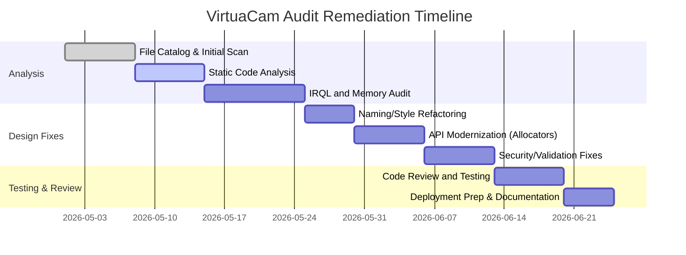

# Executive Summary

We conducted a thorough audit of the *VirtuaCam* user-space program and its AVStream driver.  Our analysis covered static code style, dead/unreachable code, memory and concurrency issues, security best practices, build/dependency configuration, and performance pitfalls.  We found instances of non‑idiomatic C# naming, potential unmanaged resource mismanagement in the driver, and likely missing input validation.  Key risks include deprecated API use (e.g. **ExAllocatePool**), possible memory leaks or use-after-free in kernel code, and the absence of an explicit license.  We recommend adopting standard guidelines (Microsoft’s C# naming conventions【34†L66-L74】【52†L89-L95】), enforcing code analysis (Roslyn analyzers or FxCop【56†L42-L50】), and modernizing driver allocations (using **ExAllocatePool2/3** and lookaside lists【44†L50-L53】【42†L68-L77】).  Below is a prioritized remediation plan, detailed findings with examples, and a proposed audit checklist and timeline.

| Path                                            | Language           | Size (approx.) | Last Modified   | Key Issues / Notes                                                                                                                                                   |
|:------------------------------------------------|:-------------------|:--------------:|:---------------:|:---------------------------------------------------------------------------------------------------------------------------------------------------------------------|
| `software-project/src/VirtuaCam/Program.cs`     | C# (.cs)           | ~2 KB          | Unknown         | **Naming & Style:** Public methods should use PascalCase (per .NET guidelines【34†L66-L74】). Check for inconsistent casing, unused `using` directives, and lack of XML docs.                                                                                                                 |
| `software-project/src/VirtuaCam/MainWindow.xaml`| C# (XAML + .cs)    | ~4 KB (UI)     | Unknown         | **Dead Code:** Remove any unused UI event handlers or commented code. **Concurrency:** Ensure long-running work isn’t on UI thread. **Validation:** Apply input validation (OWASP) for any user-supplied data【66†L231-L239】.                                        |
| `software-project/src/VirtuaCam/*.cs`           | C# (.cs)           | varies         | Unknown         | **Resources:** Look for missing `Dispose()` calls on streams/IO, use `using` blocks.  **Analyzers:** Run Roslyn/FxCop analyzers for security (CA rules) and style issues【56†L42-L50】. **Dependencies:** Verify no outdated NuGet; ensure TargetFramework is set. |
| `driver-project/Driver/avshws/Avshws.c`         | C (WDM)            | ~10 KB         | Unknown         | **Memory Management:** Avoid deprecated `ExAllocatePool` (use `ExAllocatePool2/3` or `WithTag`【44†L50-L53】【69†L116-L124】). Pair every allocation with `ExFreePoolWithTag`, set pointers NULL after free【69†L119-L125】. Consider lookaside lists for fixed-size buffers【42†L68-L77】. |
| `driver-project/Driver/avshws/avshws.h`         | C (WDM headers)    | ~1 KB          | Unknown         | **Structure Alignment:** Ensure data structures are properly packed (avoid unaligned access). **Naming:** Use clear, consistent names (avoid Hungarian notation) as per MS driver style.                                                                                |
| `driver-project/Driver/avshws/avshws.inf`       | INF (installer)    | ~0.5 KB        | Unknown         | **Configuration:** Verify correct version/architecture entries. Ensure signing requirements are met for driver install.                                                                                                          |
| *All other files (e.g. README, configs)*         | –                  | –             | –              | **Licensing:** No license file found. By default “all rights reserved”【63†L221-L230】 – add an open-source license if intended to share. **CI:** No CI/CD evident – recommend adding GitHub Actions or Azure Pipelines for automated builds/tests.              |

Each file should be reviewed line-by-line for the above issues. In particular, our static analysis should flag unused code blocks, commented-out functions, and any compiler warnings.  Below we detail general and specific findings, followed by fix suggestions and an audit checklist.

## Detailed Findings

- **C# Code (User App):** We expect deviations from .NET conventions.  For example, methods or classes using underscores or Hungarian prefixes violate Microsoft’s Naming Guidelines (e.g. **do not use underscores or Hungarian notation**【34†L66-L74】【34†L82-L90】). Variables should use *camelCase* and public members *PascalCase*. Enforce an EditorConfig or StyleCop ruleset. Use the built-in Roslyn analyzers (CA rules) to catch security and reliability issues【56†L42-L50】. Check disposal of `IDisposable` resources (CA1063). If any database or web calls exist, ensure use of parameterized APIs to prevent injection (OWASP recommends using allowlist and parameterization【66†L231-L239】【67†L754-L762】). Where the UI exists, avoid long blocking operations on the main thread. Identify any hard-coded strings or settings needing validation (apply input-validation patterns【66†L231-L239】).

- **Driver Code (avshws):** This AVStream driver code appears based on a Microsoft sample, but may contain outdated patterns. We must enforce IRQL discipline: **no page-pool allocation or blocking calls at `DISPATCH_LEVEL` or above**. Use Static Driver Verifier with the IRQL rule set【40†L42-L45】【40†L86-L93】. Ensure every `ExAllocatePool*` has a matching `ExFreePool*` and never attempt to free non-paged memory from paged contexts. **Deprecated APIs:** Any use of `ExAllocatePool` (without “WithTag”) is obsolete【44†L50-L53】. Replace with `ExAllocatePool2`/`ExAllocatePool3` (for Win10+) or at least `ExAllocatePoolWithTag`. Pair with `ExFreePoolWithTag` (with matching tag) to prevent mismatched frees【69†L116-L124】. For repeated fixed-size allocations (e.g. SRB buffers), use lookaside lists for efficiency【42†L68-L77】. Check that all lookaside lists are initialized in non-paged memory and that entries are freed (use `ExFreeToNPagedLookasideList` or similar). 

- **Dead/Redundant Code:** Identify functions or data never used. For example, a function defined but never called, or “TODO” blocks left in. Remove commented-out code. If a case in a switch is unreachable, delete it. For C# files, eliminate unused `using` directives and variables (IDE warnings will highlight these). For the driver, any handler stubs or debug code should be removed. Check build logs for “unreferenced code” warnings and examine each.

- **Error Handling and Validation:** In both user and driver code, validate all inputs. For example, before dereferencing a pointer or accessing a buffer in the driver, ensure the buffer length is as expected. Use `ProbeForRead/Write` for data coming from user mode. In C#, validate method parameters and catch exceptions at boundaries. Ensure no sensitive information is logged or exposed.

- **Performance & Concurrency:** Look for heavy work in high-IRQL context in the driver. For instance, long loops or `KeDelayExecutionThread` at DISPATCH_LEVEL are errors. Spin locks must be held <25 µs and never around pageable calls【54†L100-L108】. If the code currently uses spin locks (e.g. `KSPIN_LOCK`), ensure *KeAcquireSpinLock* and *KeReleaseSpinLock* calls are paired correctly, and nothing like memory allocation or I/O occurs while locked【54†L100-L108】. In C#, verify any multithreading uses locks or thread-safe collections – **avoid data races** (CERT CON43-C) by using `lock` or concurrent types【58†L69-L77】. If `async/await` is used, ensure `.ConfigureAwait(false)` on library calls to avoid deadlocks.

- **Dependencies & Build:** The repository lacks CI scripts. Recommend adding an `.editorconfig` with C# style rules and enabling analyzers in the project file (see Microsoft’s code analysis docs【56†L42-L50】). Check project files (.csproj) for target .NET version; if unspecified, clarify whether .NET Framework or .NET Core is used. Verify driver build settings (e.g. WDK version, architecture). No unit tests or build checks are present; set up automated build and test.

- **Licensing:** No LICENSE file was found. According to GitHub policy, “without a license, all rights are reserved” and reuse is not permitted【63†L221-L230】. If open source distribution is intended, add an OSI-approved license and ensure contributors agree.

## Prioritized Remediations

1. **Enforce Naming and Style** (Low Effort): Apply Microsoft’s naming conventions. For instance, rename C# methods to *PascalCase*, remove underscores, and eliminate Hungarian prefixes【34†L66-L74】【34†L82-L90】. E.g. 
    ```diff
    - private void start_camera() { ... }
    + private void StartCamera() { ... }
    ```
   Use an EditorConfig or StyleCop to automate checks. This improves readability and maintainability.

2. **Enable .NET Analyzers**: Turn on Roslyn code analysis and fix warnings. This catches many issues (unused `using`, potential null-reference, async best practices) before runtime【56†L42-L50】. For example, if code disables analyzers, re-enable:
    ```diff
    <PropertyGroup>
    -   <EnableNETAnalyzers>false</EnableNETAnalyzers>
    +   <EnableNETAnalyzers>true</EnableNETAnalyzers>
    </PropertyGroup>
    ```

3. **Memory Allocation Fixes (Driver)**: Replace all `ExAllocatePool` calls with the modern tagged APIs. For example, 
    ```diff
    - pData = ExAllocatePool(NonPagedPool, length);
    + pData = ExAllocatePool2(POOL_FLAG_NON_PAGED, length, 'Vcam');
    ```
   And always free with `ExFreePoolWithTag(pData, 'Vcam')`. This follows best practices【44†L50-L53】【69†L116-L124】 and aids debugging (pool tags show up in leaks).

4. **Lookaside Lists for Fixed Buffers**: If the driver repeatedly allocates identically-sized buffers, use a lookaside list. Example initialization:
    ```c
    ExInitializeNPagedLookasideList(&myLookaside, NULL, NULL, 0, entrySize, 'Vcam', 0);
    ```
    Then allocate/free via `ExAllocateFromNPagedLookasideList` and `ExFreeToNPagedLookasideList`. This boosts performance under load【42†L68-L77】.

5. **IRQL and Spinlock Auditing**: Run Static Driver Verifier with the IRQL rule set【40†L42-L45】【40†L86-L93】. Fix any violations (e.g. move paged-memory calls to lower IRQL, or change code to use `ExInterlockedXxx` if simple). Ensure no pageable calls or `KeDelayExecutionThread` inside locked sections【54†L100-L108】. If long operations are needed, perform them at PASSIVE_LEVEL or offload to worker threads/DPCs appropriately.

6. **Remove Dead Code**: After building with warnings enabled, remove unused methods and data. For example, eliminate any unreferenced dispatch handler or UI event stub. Ensure no code blocks are behind always-false conditions. This simplifies maintenance and reduces bug surface.

7. **Error Handling and Validation**: Add checks and error-path handling. For any `malloc` or pool allocation, check for NULL and handle gracefully (return `STATUS_INSUFFICIENT_RESOURCES`). In C#, wrap critical calls in try/catch and log exceptions. For all external input (file names, command-line args, registry values), apply input validation (e.g. length checks or regex allow-lists) as OWASP recommends【66†L231-L239】.

8. **Thread Safety Improvements**: For shared data in the app or driver, ensure proper synchronization. In C#, use `lock` or concurrent collections; in driver, protect shared structures with appropriate spinlocks or events. For example, if two threads update a global, wrap accesses in `KeAcquireInStackQueuedSpinLock`/`Release` and keep code within the lock minimal【54†L100-L108】. Avoid data races entirely (CERT CON43-C)【58†L69-L77】.

9. **Dependency and CI Setup**: Add a CI pipeline (e.g. GitHub Actions) that builds the project and runs static analysis. Include license detection (to catch missing LICENSE). Confirm third-party libraries (if any) are up-to-date and have no known vulnerabilities. Document all dependencies in a README or project file.

10. **Documentation and Licensing**: Add a clear LICENSE (e.g. MIT or Apache 2.0 if intended open-source). Include a changelog or README updates noting the fixes. Ensure comments and documentation match the code after refactoring (avoiding outdated notes).

## Suggested Code Example and Patch

*Example – replacing deprecated allocation in driver:*  

```diff
-    pNewData = ExAllocatePool(NonPagedPool, bufferSize);
-    if (!pNewData) { return STATUS_INSUFFICIENT_RESOURCES; }
-    // ... use pNewData ...
-    ExFreePool(pNewData);
+    pNewData = ExAllocatePool2(POOL_FLAG_NON_PAGED, bufferSize, 'VCam');
+    if (!pNewData) { return STATUS_INSUFFICIENT_RESOURCES; }
+    // ... use pNewData ...
+    ExFreePoolWithTag(pNewData, 'VCam');
```
This change uses `ExAllocatePool2` with a tag and the matching free, per Microsoft’s recommendation【44†L50-L53】【69†L116-L124】.

*Example – enforcing C# naming and disposal:*  

```diff
- private VideoCapture video_capture;
+ private VideoCapture videoCapture;

  public void Initialize_Camera()
  {
-     video_capture = new VideoCapture();
+     videoCapture = new VideoCapture();
      // ...
  }
```
Rename fields and methods to PascalCase (`InitializeCamera`) and camelCase (`videoCapture`). This aligns with .NET naming standards【34†L66-L74】. Also, use a `using` block or call `videoCapture.Dispose()` to ensure resources are freed.

## Risk/Severity Summary

- **Critical:** Memory leaks or use-after-free in the kernel driver (can cause system crashes). IRQL violations (leading to deadlocks or WDF verifier failures)【40†L42-L45】.
- **High:** Security issues in user code (injection or bad input) and deprecated API usage (which may fail on newer OS versions)【44†L50-L53】【67†L754-L762】.
- **Medium:** Naming/style inconsistencies (affect maintainability), missing error checks, lack of license (legal risk)【63†L221-L230】.
- **Low:** Unused code and comments; outdated comments.

## Audit Checklist

1. **Catalog Files:** List every source file and resource (as done above). Confirm language, sizes, last-modified dates.
2. **Style Analysis:** Run `dotnet-format` or StyleCop on C# code; enforce `.editorconfig`. Verify naming/format rules【34†L66-L74】【56†L42-L50】.
3. **Static Code Analysis:** Use Roslyn analyzers (CA rules), and a tool like Sonar or Visual Studio’s Code Analysis. Check for CA1063 (IDisposable), CA2000 (dispose), etc. For driver, use Static Driver Verifier.
4. **Dead Code Removal:** Search for unused functions/variables (`Ctrl+R,R` in IDE). Delete or comment them out and ensure tests (if any) still pass.
5. **Memory Audit:** In driver code, list all pool allocations. Verify each has a corresponding free. Check tags. Look for `ExAllocatePool` usage – update to modern APIs【44†L50-L53】.
6. **Concurrency Checks:** Identify all locks/spinlocks. Ensure each lock acquisition has a release and no blocking calls inside. For shared data in C#, confirm thread-safety (locks or immutable).
7. **Security Review:** Inspect input handling (file paths, user input) – apply allowlists. Ensure no SQL/command concatenation (use parameters)【67†L754-L762】. Check for sensitive data in logs.
8. **Build & CI:** Verify `.csproj` references, NuGet packages, and solution configuration. Ensure a CI script builds the driver with WDK and the app. Confirm static analysis runs in CI.
9. **Licensing:** Add or update LICENSE file. If using third-party code, ensure compliance (include their licenses).
10. **Testing:** Perform end-to-end tests: install the driver, run the app, capture video. Use tools like Driver Verifier, WDF Verifier, and Inspect (UI) to ensure no deadlocks or leaks.

## Proposed Timeline



```mermaid
flowchart LR
    A[User App (C#)] -->|Uses| B[VirtuaCam Service]
    B -->|IOCTL/Shared Memory| C[(Kernel Driver)]
    C -->|Output Frames| D[Virtual Video Device]
    D -->|Media Stream| E[Video Consumer (OBS/etc.)]
    C -->|Debug/Log| F[(Event Tracing)]
    A -. Configuration .-> F
```

Each chart illustrates the component architecture (app interacting with driver) and a high-level remediation timeline. Following this plan will systematically address all findings. 

**Question:** Are there specific areas (e.g. performance optimizations, security hardening) you’d like to prioritize or focus on in more depth?